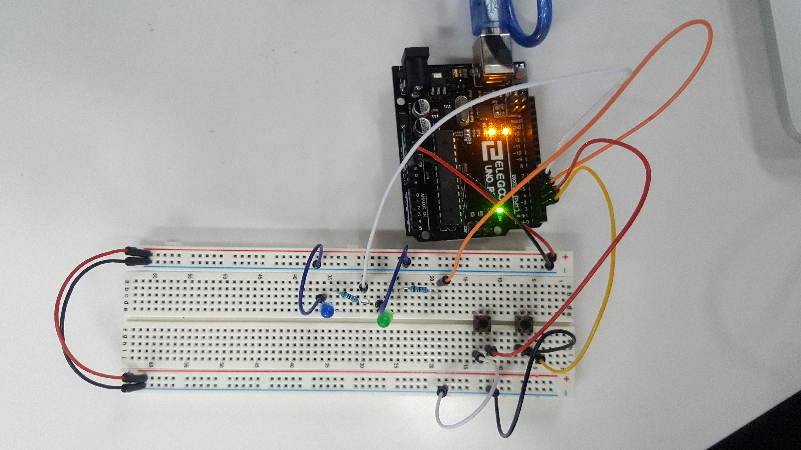

# Input Pull Up
When you connect input without the correct resistance it is really probable that you read trash. This can be solved by in two ways: adding the missing resistance or state the input as a pull up input which will solve it but will turn around the values, high will be low and the pther way around. 

In this activity I show this with two leds and two buttons. The outermost button is button 1. Button 1 is not defined and as pull up input so you can see how its value changes sometimes in the green led. On the other hand, the button 2 is connected as pullup, so it works just fine.

## Connection

